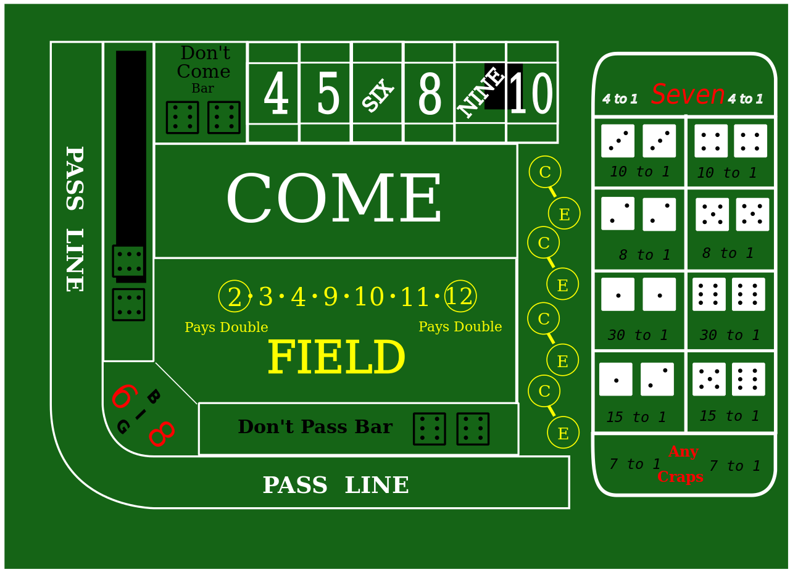

# Craps

As mentioned in the introduction, craps is the game that fascinated me the most in terms of how it could be modeled mathematically.  There are a variety of bets in craps.  [Wikipedia](https://en.wikipedia.org/wiki/Craps#) divides them into three types:

1. Line Bets (pass line, don't pass line, come line, and don't come line)
2. Multi-Roll Bets (place and "hard way" bets)
3. Single-Roll Bets

The single-roll bets are the easiest to analyze, so we'll start there.  But the line bets (in particular the pass line) is where things really get fun.

## Dice Odds

Since we haven't discussed this previously, let's take a quick detour and discuss the odds of different outcomes when rolling a pair of die.  The outcomes and probabilities of each outcome are shown below:

| Outcome | Ways to Roll It | Probability                        |
|:-------:|:---------------:|------------------------------------|
| 2       | 1               | $$ \frac{1}{36} \approx 2.78\% $$  |
| 3       | 2               | $$ \frac{2}{36} \approx 5.56\% $$  |
| 4       | 3               | $$ \frac{3}{36} \approx 8.33\% $$  |
| 5       | 4               | $$ \frac{4}{36} \approx 11.11\% $$ |
| 6       | 5               | $$ \frac{5}{36} \approx 13.89\% $$ |
| 7       | 6               | $$ \frac{6}{36} \approx 16.67\% $$ |
| 8       | 5               | $$ \frac{5}{36} \approx 13.89\% $$ |
| 9       | 4               | $$ \frac{4}{36} \approx 11.11\% $$ |
| 10      | 3               | $$ \frac{3}{36} \approx 8.33\% $$  |
| 11      | 2               | $$ \frac{2}{36} \approx 5.56\% $$  |
| 12      | 1               | $$ \frac{1}{36} \approx 2.78\% $$  |

Notice that the most likely outcome of any roll is 7.  This is important in craps where many bets are either betting for or betting against a 7 being thrown.  The least likely numbers to occur are 2 and 12 since there is only one combination of the die that result in each of these.

## Single Roll (proposition) Bets

Single roll bets are the easiest to analyze because you only bet on one throw of the die. You either win or lose based on the outcome, and the results can be calculated very easily.  Examples of these bets include:

* Field
* Service Bets (the bets in the middle, including snake eyes, box cars, and other specific outcomes)
* C&E Bets

### Service Bets

Once again, we'll start with the easiest of these: the service bets. These are the bets in the middle of the table.  They show a specific outcome (such as "snake eyes" or "box cars") and the payout for winning.  The table below quickly summarizes the results of these bets:

| Bet       | Payout  | Probability        | Expected Return |
|:----------|:-------:|:------------------:|:---------------:|
| 2, 12     | 30 to 1 | $$ \frac{1}{36} \approx  2.78\% $$ | $$ \frac{30}{36}   - \frac{35}{36} = -\frac{5}{36} \approx -13.89\% $$ |
| 3, 11     | 15 to 1 | $$ \frac{2}{36} \approx  5.56\% $$ | $$ \frac{15*2}{36} - \frac{34}{36} = -\frac{4}{36} \approx -11.11\% $$ |
| Any Craps | 7 to 1  | $$ \frac{4}{36} \approx 11.11\% $$ | $$ \frac{7*4}{36}  - \frac{32}{36} = -\frac{4}{36} \approx -11.11\% $$ |
| Any 7     | 4 to 1  | $$ \frac{6}{36} \approx 16.67\% $$ | $$ \frac{4*6}{36}  - \frac{30}{36} = -\frac{6}{36} \approx -16.67\% $$ |

### C&E

The C&E bet is a combined bet where you are betting half your money on craps and half on eleven.  The payouts on each half of the bet are the same as in the service bet table.  The result is that a craps win pays out 3-to-1 and a win on 11 pays out 7-to-1.  To understand why, imagine you bet \$2 and roll craps.  The \$1 you bet on craps returns 7-to-1, but you lose the \$1 you bet on 11.  This means you get \$6 for your \$2 bet.  If you bet \$2 and roll 11, the \$1 you bet here wins \$15.  You lose the \$1 you bet on craps, so you get \$14 back for your \$2 bet.  With these modified payouts in mind, here are the expectations of this bet:

| Outcome | Payout | Probability                         | Result                               |
|:--------|:------:|:-----------------------------------:|:------------------------------------:|
| Craps   | \$3     | $$ \frac{4}{36}  \approx 11.11\% $$ | $$ \frac{12}{36}  \approx  0.3333 $$ |
| 11      | \$7     | $$ \frac{2}{36}  \approx  5.56\% $$ | $$ \frac{14}{36}  \approx  0.3389 $$ |
| Lose    | -\$1    | $$ \frac{30}{36} \approx 83.33\% $$ | $$ -\frac{30}{36} \approx -0.8333 $$ |
| Total   |        | 100%                                | $$ -\frac{4}{36}  \approx -0.1111 $$ |

The result is a -11.11% return.  This shouldn't be surprising since this is the same return on the 11 bet and the "Any Craps" bet individually.  If we bet them as a combined bet, we should expect the same return.

### Field

The Field bet is a one-roll bet that wins if you roll a 2, 3, 4, 9, 10, 11, or 12.  The bet pays even money on everything except the 2 and 12.  These will either both pay 2-to-1 or the 2 will pay 2-to-1 and the 12 will pay 3-to-1.  The outcomes and payouts for both pay schedules are shown below:

| Outcome         | Probability      | Payout (2-to-1 on 12) | Payout (3-to-1 on 12) |
|-----------------|------------------------------------------------------------|-----|-----|
| 12              | $$ \frac{1}{36} \approx 2.78\% $$                          |  \$2 |  \$3 |
| 2               | $$ \frac{1}{36} \approx 2.78\% $$                          |  \$2 |  \$2 |
| 3, 4, 9, 10, 11 | $$ \frac{2+3+4+3+2}{36} = \frac{14}{36} \approx 38.89\% $$ |  \$1 |  \$1 |
| 5, 6, 7, 8      | $$ \frac{4+5+6+5}{36}   = \frac{20}{36} \approx 55.56\% $$ | -\$1 | -\$1 |

If you do the weighted sum (probability * payout) you will find the following expected returns:

* 2-to-1 on 12 : $\frac{2+2+14-20}{36} = -\frac{2}{36} \approx -5.56\%$
* 3-to-1 on 12 : $\frac{3+2+14-20}{36} = -\frac{1}{36} \approx -2.78\%$

## Multi-Roll Bets

Multi-roll bets are typically bets that a specific number will be rolled before rolling a 7.  An example of these are the "hard way" bets where you can bet that a 4 will be rolled as doubles before a 7.  The bet will not resolve until one of these events happens, meaning that several rolls of the die are likely to occur before you win or lose.  This is where we will need to make use of our formulas for summing infinite series.  Specifically, we will need the formula for the sum of a geometric series:

$$ \sum\limits_{k=0}^{\infty}{r^{k}} = \frac{1}{1-r}  $$

which is applicable when $ \left|r\right| < 1 $ .

### Big 6 & Big 8

Big 6 and Big 8 bets are notoriously bad bets.  Experienced players avoid them (and some casinos don't even put them on the table) because you can make a place bet that is effectively the same bet with a better payout.  However, these are easy ones with which we can begin our multi-roll outcome analysis.  The big 6 bet wins if a 6 comes up before a 7.  Similarly, the big 8 bet wins if an 8 comes up before a 7.  Since 6 and 8 are equally-likely to be rolled, we can calculate their odds together.  Each bet pays even money.

On any roll we have the following 3 outcomes:

| Outcome  | Probability                         |
|----------|-------------------------------------|
| Win      | $$ \frac{5}{36}  \approx 13.89\% $$ |
| Lose     | $$ \frac{6}{36}  \approx 16.67\% $$ |
| Continue | $$ \frac{25}{36} \approx 69.44\% $$ |

Eventually, we will have to either win or lose, although we may have any number of "continue" rolls occur before that final result. This means that the odds of winning are:

$$ \frac{5}{36} +
\frac{25}{36} \frac{5}{36} +
(\frac{25}{36})^{2} \frac{5}{36} + \dots
= \frac{5}{36} \sum\limits_{k=0}^{\infty}{(\frac{25}{36})^{k}} $$

The first term in this infinite series represents the probability of winning on the first roll; the second term, the second roll; etc.. We can use the formula for summing an infinite series to get the total probability of winning as:

$$ \frac{5}{36} \sum\limits_{k=0}^{\infty}{(\frac{25}{36})^{k}}
= \frac{5}{36} \frac{1}{1-\frac{25}{36}}
= \frac{5}{36} \frac{36}{11}
= \frac{5}{11}
\approx 45.45\% $$

While we know that the odds of losing must be the complement of this ($\frac{6}{11}$) we can also work these out the long way and sum them as an infinite series as well.  The result will be:

$$ \frac{6}{36} \sum\limits_{k=0}^{\infty}{(\frac{25}{36})^{k}}
= \frac{6}{36} \frac{1}{1-\frac{25}{36}}
= \frac{6}{36} \frac{36}{11}
= \frac{6}{11}
\approx 54.54\% $$

This means that the expected return of this bet is:

$$ \frac{5}{11} * 1 + \frac{6}{11} * (-1) = -\frac{1}{11} \approx 9.09\% $$

### Hard-Way Bets

Hard-way bets pay out if you roll a specific number (4, 6, 8, or 10) the "hard way" (i.e. as doubles) before you roll it the "soft way" or roll a 7.  The odds for 4 and 10 are the same, as they are also for 6 and 8.  The table below illustrates the outcomes and probabilities for 4 and 10:

| Outcome  | Probability                                                      |
|----------|------------------------------------------------------------------|
| Win      | $$ \frac{1}{36} \approx 2.78\% $$                                |
| Lose     | $$ \frac{6}{36} + \frac{2}{36} = \frac{8}{36} \approx 22.22\% $$ |
| Continue | $$ \frac{27}{36} = 75\% $$                                       |

This means the total probability of winning is:

$$ \frac{1}{36} \sum\limits_{k=0}^{\infty}{(\frac{27}{36})^{k}}
= \frac{1}{36} \frac{1}{1-\frac{27}{36}}
= \frac{1}{36} \frac{36}{9}
= \frac{1}{9}
\approx 11.11\% $$

This bet pays out 7-to-1. The expected return is thus:

$$ \frac{1*7}{9} - \frac{8}{9} = -\frac{1}{9} \approx -11.11\% $$

When betting hard 6 or 8 the outcomes are as shown:

| Outcome  | Probability                                                      |
|----------|------------------------------------------------------------------|
| Win      | $$ \frac{1}{36} \approx 2.78\% $$                                |
| Lose     | $$ \frac{6}{36} + \frac{4}{36} = \frac{10}{36} \approx 27.78\% $$ |
| Continue | $$ \frac{25}{36} \approx 69.44\% $$                                       |

This means the total probability of winning is:

$$ \frac{1}{36} \sum\limits_{k=0}^{\infty}{(\frac{25}{36})^{k}}
= \frac{1}{36} \frac{1}{1-\frac{25}{36}}
= \frac{1}{36} \frac{36}{11}
= \frac{1}{11}
\approx 9.09\% $$

The probability of winning on a hard 6 or 8 is lower than that of a 4 or 10 because there are more "soft" ways to roll these numbers and thus higher probabilities of losing. The payout is higher though, at 9-to-1 it gives the following expected return:

$$ \frac{1*9}{11} - \frac{10}{11} = -\frac{1}{11} \approx -9.09\% $$

NOTE: Many craps tables (including the image in this section) show the odds as "8 to 1" for the hard 4 and 10 and "10 to 1" for hard 6 and 8.  These really mean "8 for 1" and "10 for 1" which are the equivalent of "7 to 1" and "9 to 1".

### Place Bets

Place bets can be made on the numbers 4, 5, 6, 8, 9, and 10.  These are bets that the corresponding number will be rolled before a 7.  The payouts for these bets are 9-to-5 on 4 or 10, 7-to-5 on 5 or 9, and 7-to-6 on 6 or 8.  (You can now see why the Big 6 and Big 8 bets are discouraged since you can make the same bet here and get a 7-to-6 payout rather than even money.)  The probabilities of outcomes for different points are shown below:

| Point   | Win | Lose | Continue |
|---------|-----|------|----------|
| 4 or 10 | $$ \frac{3}{36} \approx  8.33\% $$ | $$ \frac{6}{36} \approx 16.67\% $$ | $$ \frac{27}{36} = 75\% $$ |
| 5 or 9  | $$ \frac{4}{36} \approx 11.11\% $$ | $$ \frac{6}{36} \approx 16.67\% $$ | $$ \frac{26}{36} \approx 72.22\% $$ |
| 6 or 8  | $$ \frac{5}{36} \approx 13.89\% $$ | $$ \frac{6}{36} \approx 16.67\% $$ | $$ \frac{25}{36} \approx 69.44\% $$ |

The probability of winning on 4 or 10 is:

$$ \frac{3}{36} \sum\limits_{k=0}^{\infty}{(\frac{27}{36})^{k}}
= \frac{3}{36} \frac{1}{1-\frac{27}{36}}
= \frac{3}{36} \frac{36}{9}
= \frac{3}{9}
\approx 33.33\% $$

The expected return is:

$$ [\frac{1}{3}(9) + \frac{2}{3}(-5)] / 5 = -\frac{1}{15} \approx -6.67\% $$

Note that we divide by 5 when calculating this return because we calculated returns on a \$5 bet.  In order to get this as a percentage that is relevant to any bet size we divide by the amount bet.

When 5 or 9 is the point, we have:

$$ \frac{4}{36} \sum\limits_{k=0}^{\infty}{(\frac{26}{36})^{k}}
= \frac{4}{36} \frac{1}{1-\frac{26}{36}}
= \frac{4}{36} \frac{36}{10}
= \frac{4}{10}
= 40\% $$

and the expected return:

$$ [\frac{4}{10}(7) + \frac{6}{10}(-5)] / 5 = -\frac{2}{50} = 4\% $$

When 6 or 8 is the point, we have:

$$ \frac{5}{36} \sum\limits_{k=0}^{\infty}{(\frac{25}{36})^{k}}
= \frac{5}{36} \frac{1}{1-\frac{25}{36}}
= \frac{5}{36} \frac{36}{11}
= \frac{5}{11}
\approx 45.45\% $$

and the expected return:

$$ [\frac{5}{11}(7) + \frac{6}{11}(-6)] / 6 = -\frac{1}{66} \approx 1.52\% $$

To summarize, we have:

| Point   | Payout | Probability of Win | Expected Return |
|---------|--------|--------------------|-----------------|
| 4 or 10 | 9-to-5 | $$ \frac{3}{9} \approx 33.33\% $$  | $$ -\frac{1}{15} \approx -6.67\% $$ |
| 5 or 9  | 7-to-5 | $$ \frac{4}{10} = 40\% $$          | $$ -\frac{2}{50} = -4\% $$           |
| 6 or 8  | 7-to-6 | $$ \frac{5}{11} \approx 45.45\% $$ | $$ -\frac{1}{66} \approx -1.52\% $$  |

### Buy Bets

A "buy" bet is similar to a "place" bet except that it pays true odds.  In exchange for this, the house takes a 5% commission.  According to Wikipedia, the minimum bet is usually \$20 so that the house can easily take its \$1 commission.  The Wizard of Odds calculates the odds as if he gave the house \$1 but left \$20 on the table for is bet (a 4.76%) commission.  We will proceed using this same calculation.  When the point is 4 or 10 we then have:

$$ [\frac{1}{3}(39) + \frac{2}{3}(-21)] / 21 = -\frac{1}{21} \approx -4.76\% $$

NOTE: We divide by 21 in the equation because we are betting \$21. When we lose, we lose all \$21 that we bet.  When we win, we should win true odds (2 to 1) for a payout of \$40.  We get \$60 total coming back our way, but we spent \$21.  This means we really only have a gain of \$39.

When the point is 5 or 9 we have:

$$ [\frac{4}{10}(29) + \frac{6}{10}(-21)] / 21 = -\frac{1}{21} = -4.76\% $$

This is similar to before. The odds of winning are 4-to-6, so the "true odds" payout is 6-to-4.  This means we win \$30 on our \$20 bet that is left after paying the \$1 commission.  This means the total gain on our bet when we win is \$29.

When the point is 6 or 8 we have:

$$ [\frac{5}{11}(23) + \frac{6}{11}(-21)] / 21 = -\frac{1}{21} \approx -4.76\% $$

Now the odds of winning are 5-to-6, meaning the "true odds" payout is 6-to-5.  This means we win \$24 on our \$20 bet and have \$23 gain when we win.

To summarize, we have:

| Point   | Payout | Probability of Win | Expected Return |
|---------|--------|--------------------|-----------------|
| 4 or 10 | 2-to-1 | $$ \frac{1}{3} \approx 33.33\% $$  | $$ -\frac{1}{21} \approx -4.76\% $$ |
| 5 or 9  | 3-to-2 | $$ \frac{2}{5} = 40\% $$           | $$ -\frac{1}{21} \approx -4.76\% $$ |
| 6 or 8  | 6-to-5 | $$ \frac{5}{11} \approx 45.45\% $$ | $$ -\frac{1}{21} \approx -4.76\% $$ |

The probabilities of winning are the same as with the "place" bets.  The expected returns are actually worse on most of these bets though - everything except when the point is a 4 or 10.

## Line Bets

Finally, we get to the "main" bet in craps: the pass line bet (and its derivatives).

### Pass Line

The pass line bet is a bet that wins immediately when you roll a 7 or 11 and loses immediately if you roll craps (2, 3, or 12).  If you roll any other number, that number becomes the "point" and you win if you roll it again before rolling a 7. The payout is even money.

We'll have to deal with this bet in two parts.  First, we will examine the initial roll - since it is so different from the rest.  Then we can look at the remaining rolls where the player is trying to roll their point before rolling a 7.  This part of the game will be identical in its probabilities to the "place" and "buy" bets we examined previously.

On the first roll, we have the following outcomes:

| Outcome            | Probability |
|--------------------|-------------|
| Win (7 or 11)      | $$ \frac{6+2}{36}   = \frac{2}{9} \approx 22.22\% $$ |
| Lose (2, 3, or 12) | $$ \frac{1+2+1}{36} = \frac{1}{9} \approx 11.11\% $$ |
| Continue           | $$ \frac{2}{3} \approx 66.67\% $$ |

We have already calculated the probabilities of rolling a specific point before rolling a 7.  These are the probabilities that will determine whether we win if do not immediately win or lose on the first roll.  As a reminder, these probabilities are:

| Point   | Probability of Occurring | Probability of Win       |
|---------|--------------------------|--------------------------|
| 4 or 10 | $$ 2 * \frac{3}{36} = \frac{1}{6}  \approx 16.67\% $$ | $$ \frac{1}{3} \approx 33.33\% $$     |
| 5 or 9  | $$ 2 * \frac{4}{36} = \frac{2}{9}  \approx 22.22\% $$ | $$ \frac{2}{5} = 40\% $$              |
| 6 or 8  | $$ 2 * \frac{5}{36} = \frac{5}{18} \approx 27.78\% $$ | $$ \frac{5}{11} \approx 45.45\% $$    |
| Any     | $$ \frac{3+4+5}{18} = \frac{2}{3}  \approx 66.67\% $$ | $$ \frac{134}{330} \approx 40.61\% $$ |

The very last number in the table might need explaining.  This is calculated by multiplying the probability of each event by the probability of winning, summing them up, and then dividing by the total probability of these events.  The first sum gives us:

$$ \frac{1}{6}\frac{1}{3} + \frac{2}{9}\frac{2}{5} + \frac{5}{18}\frac{5}{11}
= \frac{268}{990} \approx 27.07\% $$

This is the probability of establishing a point _and_ then winning.  If we just want the probability of winning given that we have established a point already, we need to divide by $\frac{2}{3}$, which is the probability of establishing a point in the first place.  This gives that final probability of winning as $\frac{134}{330}$.

We now have all the information we need to calculate the total probability of winning this bet.  It is equal to the probability of winning on the first roll ($\frac{2}{9}$) plus the probability of establising a point ($\frac{2}{3}$) multiplied by the probability of winning once that point is established ($\frac{134}{330}$).  This is:

$$ \frac{2}{9} + \frac{2}{3}\frac{134}{330} = \frac{448}{990} = \frac{244}{495} \approx 49.29\% $$

The expected value of this bet is then:

$$ \frac{244}{495} - \frac{251}{495} = -\frac{7}{495} \approx -1.41\% $$

This is one of the best bets in the casino.  It has a very low house edge.  It is definitely better than any of the other bets we have calculated so far in craps. And with pass odds, it can get even better.

### Pass odds

Pass odds is a bet that can be made behind the pass line once a point is established.  This is a bet that the point will be made before rolling a 7. Unlike any other bet in the game (or in the casino), this bet pays "true odds".  This means it pays 2-to-1 on 4 and 10, 3-to-2 on 5 and 9, and 6-to-5 on 6 and 8. As grandpa would say: "You're an idiot if you don't make this bet.  It's the best bet in the house." You'll want to make sure you bet enough to get the full payout.  A bet of \$10 is enough to do this regardless of the point.

Casinos typically limit how much you are allowed to bet here.  Common limitations are "single odds" (equal to your pass line bet) and "double odds" (equal to twice your pass line bet).  Some will offer higher limits though or even no limit at all.  If you combine this bet with your original pass line bet and calculate the total return, the house edge will shrink below 1.41%.  The larger your pass odds bet, the smaller the house edge.  This is because the house is only making money off your original bet.  There is no house edge on your pass odds bet.

Let's calculate the expected return on a pass line bet combined with an odds bet behind it.  First, we'll bring back the equation for the expected return on a pass line bet:

$$ \frac{2}{9}(1) + \frac{1}{9}(-1) + \frac{2}{3}(\frac{134}{330}(1) + \frac{196}{330}(-1)) $$

Remember the terms in this equation relate to:

* Winning on the first roll ($\frac{2}{9}$)
* Losing on the first roll ($\frac{1}{9}$)
* Continuing beyond the first roll ($\frac{2}{3}$) to:
  * Win ($\frac{134}{330}$)
  * Lose ($\frac{196}{330}$)

We could try to add in terms that reflect the payout on the pass odds bet.  These would only be relevant in the cases where we continue beyond the first roll (which only happens $\frac{2}{3}$ of the time). While the payouts vary based on the point, the expected value of the payouts on the pass odds bet do not change. They are always zero. If the point were 4 the expected value of our pass odds bet is:

$$ \frac{1}{3}(2) + \frac{2}{3}(-1) = 0 $$

So if we do add these terms into the second half of the equation they will all disappear, leaving us with the original equation. The one thing that does change though is the amount of money we bet.  In $\frac{1}{3}$ of the cases, we will win after the first roll, meaning we stick with our original bet of \$1.  In $\frac{2}{3}$ of the cases we will get to put another bet behind the line, increasing our total bet to \$2.  The weighted average of these is:

$$ \frac{1}{3}(1) + \frac{2}{3}(2) = \frac{5}{3} $$

This is the average amount we will bet on any hand.  Dividing our original equation by this to get it in terms of the amount bet yields:

$$ -\frac{7}{495} / \frac{5}{3} = -\frac{7}{825} \approx 0.81\% $$

Similarly, if we are allowed to double-down behind the line, our overall return based on the money in play is now:

$$ -\frac{7}{495} / (\frac{1}{3}(1) + \frac{2}{3}(3)) = -\frac{1}{165} \approx 0.61\% $$

### Don't Pass

The "don't pass" bet is basically the opposite of the "pass line" bet.  It is a somewhat unpopular bet because it means you are betting against the shooter (and they don't tend to like that). The bet wins immediately on 2 or 3.  It pushes on a 12.  (In some casinos it wins on 3 or 12 and pushes on 2, but this does not affect the odds).  If a point is established, you are then betting against the player making his point.  You win if a 7 is rolled before they make their point, and you lose if they make the point.  Note that the push on a 12 (or a 2) is necessary for the house to maintain its edge.  If you were to have a bet that was truly the opposite of the pass line, it would mean that you'd have a positive advantage in the game.

The first roll has the following outcomes and probabilities:

| Outcome            | Probability |
|--------------------|-------------|
| Push (12)          | $$ \frac{1}{36} \approx 2.78\% $$ |
| Win (2, 3)         | $$ \frac{1+2}{36} = \frac{1}{12} \approx 8.33\% $$ |
| Lose (7 or 11)     | $$ \frac{6+2}{36} = \frac{2}{9} \approx 22.22\% $$ |
| Continue           | $$ \frac{2}{3} \approx 66.67\% $$ |

The probability against making the points are simply the complements from the "pass line" bet table.  These are:

| Point   | Probability of Occurring | Probability of Win       |
|---------|--------------------------|--------------------------|
| 4 or 10 | $$ 2 * \frac{3}{36} = \frac{1}{6}  \approx 16.67\% $$ | $$ \frac{2}{3} \approx 66.67\% $$     |
| 5 or 9  | $$ 2 * \frac{4}{36} = \frac{2}{9}  \approx 22.22\% $$ | $$ \frac{3}{5} = 60\% $$              |
| 6 or 8  | $$ 2 * \frac{5}{36} = \frac{5}{18} \approx 27.78\% $$ | $$ \frac{6}{11} \approx 54.54\% $$    |
| Any     | $$ \frac{3+4+5}{18} = \frac{2}{3}  \approx 66.67\% $$ | $$ \frac{196}{330} \approx 59.39\% $$ |

The total probability of winning is then:

$$ \frac{1}{12} + \frac{2}{3}\frac{196}{330} = \frac{949}{1980} \approx 47.93\% $$

The expected value of this bet is then:

$$ \frac{949}{1980}(1) + \frac{1}{36}(0) + \frac{976}{1980}(-1) = -\frac{27}{1980} = -\frac{3}{220} \approx -1.36\% $$

This is actually a slightly better bet than the pass line bet.  However, you will have to weather the stares (and perhaps a few words) from the people at the table who you are betting against.

### Don't Pass Odds

As with the pass line bet, you can also place an odds bet on your "don't pass" bet if a point is established. You are now betting that a 7 will be rolled before the point is made.  This also pays "true odds" meaning that it pays 1-to-2 for 4 or 10, 2-to-3 for 5 or 9, and 5-to-6 for 6 or 8.

## Summary

We've covered a lot in this page.  The following table brings together our primary results in one place:

| Bet                      | House Edge |
|--------------------------|--------|
| Pass Line                |  1.41% |
| Don't Pass Line          |  1.36% |
| Pass Line (with 1x odds) |  0.81% |
| Pass Line (with 2x odds) |  0.61% |
| Place: 6 or 8            |  1.52% |
| Place: 5 or 9            |  4.00% |
| Place: 4 or 10           |  6.67% |
| Buy Bets                 |  4.76% |
| Big 6 or 8               |  9.09% |
| Hard 6 or 8              |  9.09% |
| Hard 4 or 10             | 11.11% |
| Field (3-to-1 on 12)     |  2.78% |
| Field (2-to-1 on 12)     |  5.56% |
| Service: 2 or 12         | 13.89% |
| Service: 3 or 11         | 11.11% |
| Service: Any Craps       | 11.11% |
| Service: Any 7           | 16.67% |
| C&E                      | 11.11% |
