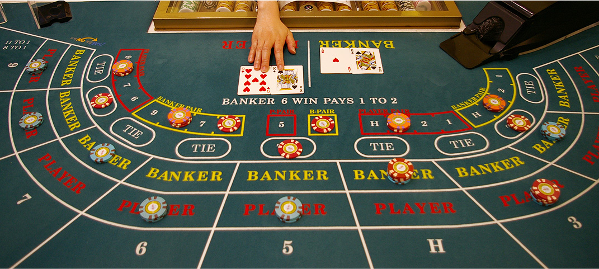

# Baccarat

## Overview

Baccarat is often mentioned as a classy game (James Bond plays it in movies) and one where billionaire "whales" can win (or lose) millions of dollars in a single night.  It also has one of the smallest house edges in the casino.  According to [Wikipedia](https://en.wikipedia.org/wiki/Baccarat_(card_game)) it is played with 6-8 decks and follows a somewhat complicated set of rules for dealing cards to a "player" and a "banker".  Observers of the game bet on whether the "player" or "banker" will win.  They also can bet on a "tie".

According to Wikipedia, the typical payouts and house advantages for these scenarios (with a 8-deck shoe) are below:

| Outcome     |   Payout | House Edge |
|:------------|---------:|-----------:|
| Banker Wins | 19-to-20 |      1.06% |
| Player Wins |   1-to-1 |      1.24% |
| Tie         |   8-to-1 |      14.4% |

## Simulation

I wrote a Baccarat simulator in Java to confirm these numbers.  The simulator played 1 billion hands of Baccarat following the classic "Punto Banco" rules as described on Wikipedia.  This took about 4 minutes to run.  The results were:

| Winner      |   Occurrences |   Percentage |
|:------------|--------------:|-------------:|
| Banker Wins |   458,618,223 |  45.8618223% |
| Player Wins |   446,309,890 |  44.6309890% |
| Tie         |    95,071,887 |   9.5071887% |
| Total       | 1,000,000,000 | 100.0000000% |

To calculate the expected return and house advantage we need to include the payouts that result from the bets for each scenario.  This is shown in the table below:

| Outcome     |   Return(B) | Return(P) | Return(T) |
|:------------|------------:|----------:|----------:|
| Banker Wins |        1.95 |         0 |         0 |
| Player Wins |           0 |      2.00 |         0 |
| Tie         |        1.00 |      1.00 |      9.00 |

Return(B) indicates the money you receive in each scenario if you bet on the banker winning.  Similarly, Return(P) and Return(T) represent bets placed on the player and a tie.

When multiplying these returns by the probability of each scenario, the expected returns and house advantages for each bet are:

| Bet      | Expected Return | House Advantage |
|:---------|----------------:|----------------:|
| Banker   |          98.94% |           1.06% |
| Player   |          98.77% |           1.23% |
| Tie      |          85.56% |          14.44% |

These match the results from Wikipedia to within +/- .01%.

If we wanted to get fancy, we could calculate confidence intervals around our estimates.  To do this, we make use of the fact that the Bernoulli distribution has a variance of "p(1-p)".  This means that when calculating p as an average of N observations we would expect a standard deviation of "p(1-p) / sqrt(N)" around our estimate of the mean.  This allows us to create the following confidence intervals around our probabilities:

| Outcome	    |       Estimate |  Stdev(Estimate) | Min(Estimate) | Max(Estimate) |
|:------------|---------------:|-----------------:|--------------:|--------------:|
| Banker Wins |	   45.8618223% |     0.00157571%  |	  45.8570952% |   45.8665494% |
| Player Wins |	   44.6309890% |     0.001572%    |	  44.6262730% |    44.635705% |
| Tie	        |     9.5071887% |     0.000927541% |    9.5044061% |    9.5099713% |

The Min and Max values of the estimate are calculated using 3 standard deviations.  This means that we have a 99% chance of the true probability being somewhere between these two values.

We can use these min and max estimates to calculate the payouts.  This time we get:

| Bet      | Expected Return | House Advantage |
|:---------|----------------:|----------------:|
| Banker   |  98.93 - 98.95% |    1.05 - 1.07% |
| Player   |  98.76 - 98.78% |    1.22 - 1.24% |
| Tie      |  85.54 - 85.59% |  14.41 - 14.46% |

1 billion hands are needed in order to get confidence intervals this small.  It is pleasing to see that the exact values from Wikipedia fall into our confidence ranges.

## Card Counting

Since Baccarat is played from a 6- or 8-deck shoe, you might naturally think there is an opportunity to count cards.  The article below provides a great summary of several experts on this subject, each of them indicating that card counting is not practical in this game:

* https://www.888casino.com/blog/baccarat-tips/card-counting-in-baccarat

The reason for this is that - unlike Blackjack - there are not cards that clearly favor the player or the banker.  There are also no choices made in the game (except for your bet size), meaning that you can't use your knowledge of the deck to play the cards differently.

Ed Thorp does provide a card-counting strategy that can yield an advantage to bets made on the player in rare scenarios.  A positive advantage of 0.329% occurs every 1,786 hands, which is far too rare to use to your advantage.  John May (a baccarat author) developed a counting strategy for betting on a tie that he claims yields a 62% advantage in certain rare scenarios.  However, these rare scenarios occur approximately once every 10,000 hands - again making it too rare to be useful.  If a player played Baccarat 40 hours a week, this scenario would occur only once every three weeks.
